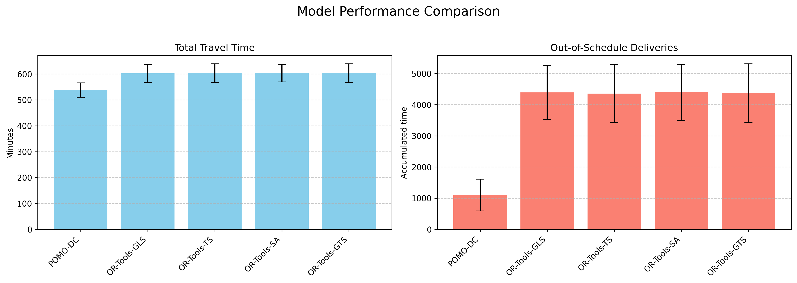
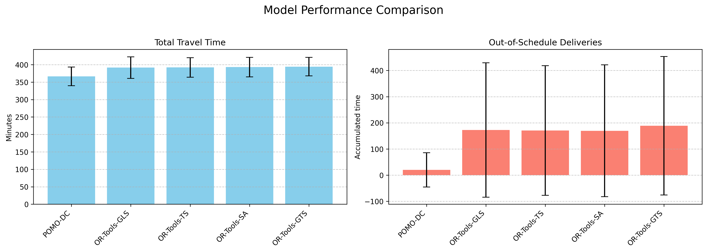
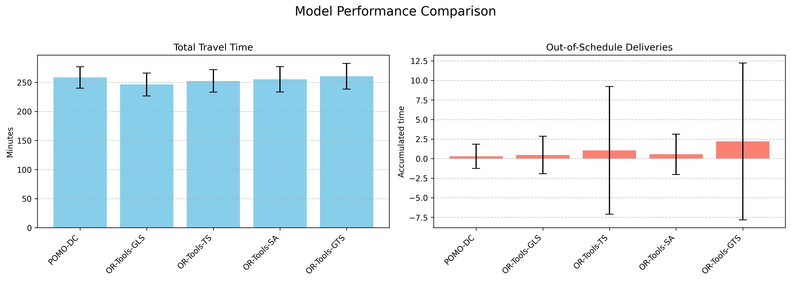
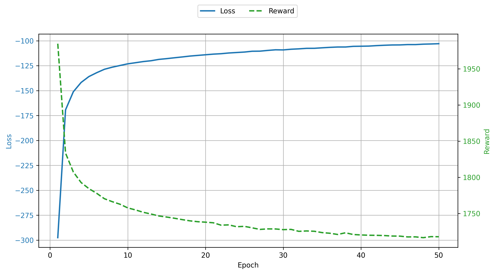
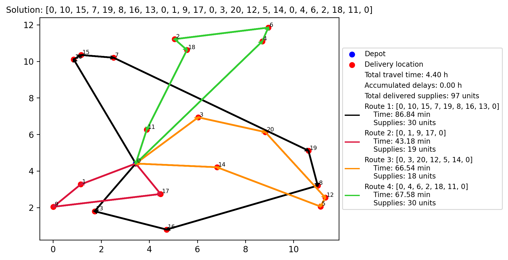

# Implementation of a DRL Model to Solve the SCVRPTSD

This repository contains the implementation of a Deep Reinforcement Learning (DRL)-based approach to solve the **Stochastic Capacitated Vehicle Routing Problem with Time Services and Deadlines (SCVRPTSD)**. This work is part of a paper under revision by my teamwork, which extends the Policy Optimization with Multiple Optima (POMO) algorithm to address the stochastic and time-sensitive nature of the problem.

## Problem Overview

The SCVRPTSD is a variant of the Vehicle Routing Problem (VRP), where:
- One or more vehicles with fixed capacities must complete a series of deliveries distributed throughout a city.
- Each route begins and ends at a central distribution depot.
- Time constraints and uncertain travel times between locations are considered.
- The goal is to minimize total travel time while ensuring that all deliveries are made within their deadlines.

## Key Features

- **Algorithm**: Extends the POMO algorithm by introducing modifications to the environment and integrating a new dynamic context within the Neural Network Model (NNM).
- **Environment**: Models a delivery system with stochastic travel times and time-sensitive constraints.
- **Performance Evaluation**: Compared against Google OR-Tools and various metaheuristics as benchmarks.

## Results

The effectiveness of the proposed method is evaluated through extensive experiments. Below are some key performance metrics:

### Total Travel Time and Out-of-Schedule Deliveries

#### Inference results for instances with $n=50$ customers


#### Inference results for instances with $n=30$ customers


#### Inference results for instances with $n=20$ customers


### Training Progress

The training process shows convergence in loss and reward over epochs.



### Solution example

The following picture is a solution plot for $n=20$ customers computed through the Neural Network Model trained over 50 epochs. The instance parameters were generated using a fixed seed of 0.



## How to Run

### Prerequisites

- **Python** (version 3.8+)
- **PyTorch** (for training and inference)
- **NumPy**
- **Matplotlib** (for visualization)
- **ortools** (Google OR-Tools Python wrapper)

### Install Dependencies

```bash
pip install torch numpy matplotlib
